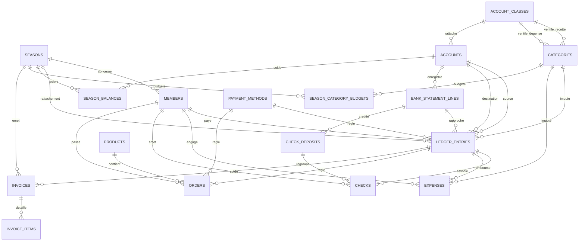
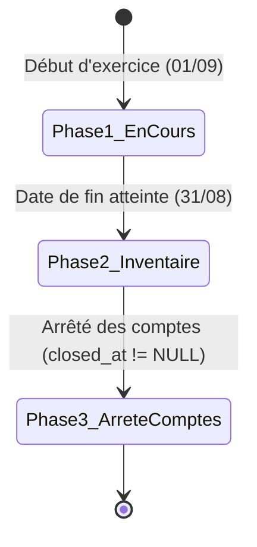

# ADR-0004: Modèle de données cible, intégrité et règles comptables associatives

- **Statut** : Accepté (Mis à jour suite révision C1)
- **Date** : 2026-07-24
- **Décideurs** : Équipe d'architecture NBA, DBA Senior, Expert-Comptable spécialisé en comptabilité associative (Loi 1901)

---

## 1. Contexte & Enjeux

L'application `nozay-bad` (Nozay Badminton) gère la vie administrative et financière d'un club sportif associatif : adhésions des membres, ventes de la boutique du club, remboursements de notes de frais et tenue de la comptabilité.

L'audit de la base de données SQLite/Cloudflare D1 (16 tables, 23 migrations accumulées) a révélé des régressions et fragilités majeures :
1. **Identifiants textuels comme PK et cibles de FK** : La table `seasons` utilisait une clé textuelle (`id = '25-26'`) référencée par 8 tables. De même, `account_classes` utilisait son code textuel (`'60'`) comme PK.
2. **Disparition des clés étrangères (FK)** : La migration 0022 a supprimé 6 contraintes FK sur `expenses` et `orders` suite à la génération automatique Drizzle depuis des schémas TS non liés. De nombreuses colonnes jouant le rôle de FK (`ledger_entries.category_id`, `expenses.category_id`, `categories.receipt_account_class_id`) n'ont jamais été contraintes en base.
3. **Ambiguïté de nommage et responsabilité des tables** :
   - `bank_transactions` regroupait sous un nom ambigu des lignes d'extraits bancaires importées, et portait à tort un `season_id` (une ligne de relevé dépend d'une période bancaire, non d'un exercice comptable). Elle est clarifiée en `bank_statement_lines`.
   - `transactions` cumulait trois sens concurrents (transaction bancaire, transaction DB, écriture comptable). Elle est renommée en `ledger_entries` (Le Grand Livre / Écritures de Trésorerie).
4. **Duplication de tables inter-domaines** : `libs/domains/shop/shared/schema.ts` redéfinissait ses propres versions de `transactions` et `categories` avec des contraintes affaiblies.
5. **Comptabilité approximative et ambiguïtés temporelles** :
   - Les montants sont exprimés en centimes mais nommés `amount` ou `price`, l'unité n'étant visible que dans l'UI.
   - Les comptes de trésorerie (`current`, `savings`, `cash`) et les modes de règlement sont des énumérations textuelles non reliées au Plan Comptable Associatif (PCA).
   - L'exercice comptable (`seasonsTable`) ne stockait ni date de début ni date de fin.
   - La clôture était un booléen `closed`, empêchant de rattacher des écritures d'inventaire (charges à payer, produits à recevoir) entre la fin de l'exercice (31 août) et l'arrêté effectif des comptes.

---

## 2. Principes de Cadrage & Règles Structurantes

### 2.1 Cadrage Comptable : Trésorerie avec Rattachement à l'Exercice

Conformément à la réglementation des associations loi 1901 de petite taille (règlement ANC 2018-06) :
- La comptabilité est tenue **en trésorerie** (enregistrements au fil des flux bancaires et de caisse).
- Le rattachement des recettes et dépenses à l'exercice concerné est assuré **directement par les écritures de trésorerie**, via la qualification de rattachement (`accrual_type` et `accrual_note`).
- **Aucune écriture de contrepartie ni compte de bilan de régularisation (486, 487, 408, 418)** n'est généré à la clôture.
- Aucun retournement d'écriture n'est à effectuer à l'ouverture de l'exercice suivant.

### 2.2 Règle Structurante des Clés & Cibles d'Intégrité

1. **Clé primaire (PK)** : Toute table possède une clé primaire entière auto-incrémentée nommée `id` (`INTEGER PRIMARY KEY AUTOINCREMENT`).
2. **Clé étrangère (FK)** : Toute clé étrangère pointe **exclusivement vers une PK entière auto-incrémentée (`id`)**.

### 2.3 Règle d'Attribution de la Colonne `code`

**Règle d'Architecture** : Une colonne `code` (`TEXT UNIQUE NOT NULL`) est attribuée à une table si et seulement si son identité fonctionnelle est définie à l'extérieur du système ou directement référencée par la logique applicative / les fichiers d'import. Les données de configuration analytiques gérées par le trésorier (comme les catégories) ne portent pas de `code`.

| Table | `code` | Justification Métier |
| :--- | :---: | :--- |
| `seasons` | ✅ | Identifiant externe naturel — l'import Poona / MyFFBaD lit une colonne Saison valant `'25-26'`. |
| `account_classes` | ✅ | Plan Comptable Associatif (PCA), défini à l'extérieur du système, universel et immuable. |
| `accounts` | ✅ | Liste fermée et stable des comptes financiers (`current`, `savings`, `cash`), référencée en configuration. |
| `payment_methods` | ✅ | Liste fermée et stable des modes de règlement (`virement`, `cheque`, `cb`), mappée depuis les imports. |
| `categories` | ❌ | Nomenclature analytique évolutive gérée par le trésorier. L'absence de code permet de scinder, fusionner ou renommer des catégories librement sans briser d'invariants système. |

**Pivot opérationnel pour Seed & Reprise** : Pour le seed (`0001_seed_reference_data.sql`) et les scripts de reprise, `admin_label` sert de pivot ponctuel. Arbitrage assumé : léger inconfort ponctuel de script compensé par la souplesse permanente du modèle.

**Impact Reprise & Conversion des Transferts** : La catégorie-marqueur "Virements Internes (Transit)" disparaît. Les écritures de transferts inter-comptes sont désormais structurellement reconnues par `type = 'transfert'` et `destination_account_id NOT NULL`. Lors de la reprise des données, les écritures historiquement catégorisées `virements_internes` doivent être converties avec un `destination_account_id` valide sous peine de violer l'invariant du `CHECK` de transfert.

### 2.4 Convention de Nommage des Montants

Toute colonne représentant un montant financier est obligatoirement exprimée en **centimes d'euros** et porte le suffixe `_cents` (ex: `amount_cents`, `total_amount_cents`, `price_cents`, `initial_balance_cents`).

---

## 3. Modèle de Données Cible Complexe (18 Tables)

Le modèle cible comprend 18 tables réparties entre les 4 domaines métier de l'application.

---

### 3.1 Domaine `members` (Propriétaire de `seasons`, `users`, `members`)

#### Table `seasons` (Exercices Comptables / Saisons Sportives)
*Propriétaire canonique de la saison et de son cycle de vie.*

| Colonne | Type SQL | Contraintes / Modificateurs | Rôle & Justification Métier |
| :--- | :--- | :--- | :--- |
| `id` | `INTEGER` | `PRIMARY KEY AUTOINCREMENT` | Clé technique unique. |
| `code` | `TEXT` | `UNIQUE NOT NULL` | Code métier (ex: `'24-25'`, `'25-26'`). Immuable. |
| `name` | `TEXT` | `NOT NULL` | Libellé d'affichage (ex: `'Saison 2025-2026'`). |
| `start_date` | `TEXT` | `NOT NULL` | Date de début d'exercice au format `YYYY-MM-DD` (ex: `'2025-09-01'`). |
| `end_date` | `TEXT` | `NOT NULL` | Date de fin d'exercice au format `YYYY-MM-DD` (ex: `'2026-08-31'`). |
| `active` | `INTEGER` | `NOT NULL DEFAULT 0` | 1 si saison active par défaut pour les inscriptions. |
| `closed_at` | `INTEGER` | `NULL` | Timestamp Unix de l'arrêté définitif des comptes. `NULL` = exercice non clôturé. |
| `approved_at` | `INTEGER` | `NULL` | Timestamp de validation des comptes en AG. |
| `created_at` | `INTEGER` | `NOT NULL` | Date de création de la saison (timestamp Unix ms). |

- **Contrainte CHECK** : `CHECK(end_date > start_date)`
- **Création lors des Imports CSV** : L'import refuse de créer une saison inconnue à la volée. Une saison représentant un exercice comptable formel avec des bornes légales (`start_date`, `end_date`), sa création exige un acte délibéré préalable du trésorier dans les paramètres de l'application.

#### Table `users` (Comptes d'accès applicatif)
| Colonne | Type SQL | Contraintes / Modificateurs | Rôle & Justification Métier |
| :--- | :--- | :--- | :--- |
| `id` | `INTEGER` | `PRIMARY KEY AUTOINCREMENT` | Clé technique. |
| `email` | `TEXT` | `UNIQUE NOT NULL` | Identifiant de connexion unique. |
| `name` | `TEXT` | `NULL` | Nom complet de l'utilisateur. |
| `role` | `TEXT` | `NOT NULL DEFAULT 'member'` | Rôle applicatif (`'admin'`, `'ca'`, `'member'`). |
| `created_at` | `INTEGER` | `NOT NULL` | Timestamp de création. |

- **Contrainte CHECK** : `CHECK(role IN ('admin', 'ca', 'member'))`

#### Table `members` (Adhérents du club)
| Colonne | Type SQL | Contraintes / Modificateurs | Rôle & Justification Métier |
| :--- | :--- | :--- | :--- |
| `id` | `INTEGER` | `PRIMARY KEY AUTOINCREMENT` | Clé technique. |
| `licence` | `TEXT` | `NOT NULL` | Numéro de licence fédéral (ex: `'06912345'`). |
| `season_id` | `INTEGER` | `NOT NULL REFERENCES seasons(id)` | Saison de l'adhésion. |
| `last_name` | `TEXT` | `NOT NULL` | Nom de famille. |
| `first_name` | `TEXT` | `NOT NULL` | Prénom. |
| `gender` | `TEXT` | `NOT NULL` | Genre (`'M'`, `'F'`). |
| `birth_date` | `TEXT` | `NOT NULL` | Date de naissance (`YYYY-MM-DD`). |
| `email` | `TEXT` | `NULL` | Adresse e-mail. |
| `phone` | `TEXT` | `NULL` | Numéro de téléphone. |
| `status` | `TEXT` | `NOT NULL DEFAULT 'valide'` | État du dossier (`'valide'`, `'suspendu'`). |
| `type` | `TEXT` | `NOT NULL` | Catégorie de cotisation (ex: `'Adulte'`, `'Jeune'`). |
| `amount_due_cents` | `INTEGER` | `NOT NULL DEFAULT 0` | Montant dû pour la saison en centimes. |
| `amount_received_cents` | `INTEGER` | `NOT NULL DEFAULT 0` | Total des règlements perçus en centimes. |
| `amount_remaining_cents` | `INTEGER` | `NOT NULL DEFAULT 0` | Solde restant à payer en centimes. |
| `paid` | `INTEGER` | `NOT NULL DEFAULT 0` | Booléen : 1 si solde intégralement réglé. |
| `imported_at` | `INTEGER` | `NOT NULL` | Horodatage de l'import CSV MyFFBaD. |

- **Index Unique** : `UNIQUE(licence, season_id)` (un membre a une seule fiche par saison).
- **Contrainte CHECK** : `CHECK(gender IN ('M', 'F'))` et `CHECK(amount_due_cents >= 0 AND amount_received_cents >= 0)`.

---

### 3.2 Domaine `accounting` (Propriétaire du Grand Livre, Facturation & Banque)

#### Table `account_classes` (Classes du Plan Comptable Général / Associatif)
| Colonne | Type SQL | Contraintes / Modificateurs | Rôle & Justification Métier |
| :--- | :--- | :--- | :--- |
| `id` | `INTEGER` | `PRIMARY KEY AUTOINCREMENT` | Clé technique unique. |
| `code` | `TEXT` | `UNIQUE NOT NULL` | Numéro de compte du PCA (ex: `'70'`, `'60'`, `'512'`). |
| `label` | `TEXT` | `NOT NULL` | Intitulé officiel (ex: `'70 - Ventes de produits et prestations'`). |
| `type` | `TEXT` | `NOT NULL` | Nature de la classe (`'recette'`, `'depense'`, `'tresorerie'`). |
| `created_at` | `INTEGER` | `NOT NULL` | Date de création. |

- **Contrainte CHECK** : `CHECK(type IN ('recette', 'depense', 'tresorerie'))`

#### Table `accounts` (Comptes de Trésorerie de l'Association)
*Nouvelle table de référence matérialisant les comptes financiers réels (Classe 5).*

| Colonne | Type SQL | Contraintes / Modificateurs | Rôle & Justification Métier |
| :--- | :--- | :--- | :--- |
| `id` | `INTEGER` | `PRIMARY KEY AUTOINCREMENT` | Clé technique unique. |
| `code` | `TEXT` | `UNIQUE NOT NULL` | Code fonctionnel (ex: `'current'`, `'savings'`, `'cash'`). |
| `label` | `TEXT` | `NOT NULL` | Nom d'usage (ex: `'Compte Courant LCL'`, `'Livret A'`, `'Caisse Buvette'`). |
| `account_class_id` | `INTEGER` | `NOT NULL REFERENCES account_classes(id)` | Rattachement PCA (ex: compte 512, 517, 530). |
| `created_at` | `INTEGER` | `NOT NULL` | Timestamp de création. |

#### Table `payment_methods` (Modes de Règlement)
*Nouvelle table de référence éliminant les strings magiques dans le code.*

| Colonne | Type SQL | Contraintes / Modificateurs | Rôle & Justification Métier |
| :--- | :--- | :--- | :--- |
| `id` | `INTEGER` | `PRIMARY KEY AUTOINCREMENT` | Clé technique. |
| `code` | `TEXT` | `UNIQUE NOT NULL` | Code technique (ex: `'virement'`, `'cheque'`, `'especes'`, `'pass_sport'`). |
| `label` | `TEXT` | `NOT NULL` | Libellé d'affichage (ex: `'Virement bancaire'`, `'Chèque'`, `'Pass\'Sport'`). |
| `created_at` | `INTEGER` | `NOT NULL` | Timestamp de création. |

#### Table `categories` (Nomenclature Analytique et Budgétaire)
| Colonne | Type SQL | Contraintes / Modificateurs | Rôle & Justification Métier |
| :--- | :--- | :--- | :--- |
| `id` | `INTEGER` | `PRIMARY KEY AUTOINCREMENT` | Clé technique unique. |
| `admin_label` | `TEXT` | `NOT NULL` | Nom pour le trésorier / back-office (ex: `'Adhésions & Inscriptions'`). |
| `adherent_label` | `TEXT` | `NOT NULL` | Nom présenté aux adhérents sur les reçus/formulaires. |
| `hide_in_expenses` | `INTEGER` | `NOT NULL DEFAULT 0` | 1 si la catégorie ne doit pas apparaître dans les notes de frais. |
| `receipt_account_class_id` | `INTEGER` | `NULL REFERENCES account_classes(id)` | Compte de produit associé (Classe 7). |
| `expense_account_class_id` | `INTEGER` | `NULL REFERENCES account_classes(id)` | Compte de charge associé (Classe 6). |
| `created_at` | `INTEGER` | `NOT NULL` | Timestamp de création. |

#### Table `ledger_entries` (Le Grand Livre / Écritures de Trésorerie)
*Anciennement nommée `transactions`. Table centrale enregistrant l'ensemble des mouvements financiers.*

| Colonne | Type SQL | Contraintes / Modificateurs | Rôle & Justification Métier |
| :--- | :--- | :--- | :--- |
| `id` | `INTEGER` | `PRIMARY KEY AUTOINCREMENT` | Clé technique unique. |
| `season_id` | `INTEGER` | `NOT NULL REFERENCES seasons(id)` | Exercice d'imputation comptable. |
| `type` | `TEXT` | `NOT NULL` | Flow de trésorerie (`'recette'`, `'depense'`, `'transfert'`). |
| `account_id` | `INTEGER` | `NOT NULL REFERENCES accounts(id)` | Compte source (débité ou crédité). |
| `destination_account_id` | `INTEGER` | `NULL REFERENCES accounts(id)` | Compte cible (uniquement pour un virement interne). |
| `category_id` | `INTEGER` | `NULL REFERENCES categories(id)` | Catégorie budgétaire/analytique (NULL pour transfert). |
| `amount_cents` | `INTEGER` | `NOT NULL` | Montant du mouvement en centimes d'euros (> 0). |
| `date` | `TEXT` | `NOT NULL` | Date effective du mouvement financier (`YYYY-MM-DD`). |
| `payment_method_id` | `INTEGER` | `NOT NULL REFERENCES payment_methods(id)` | Mode de règlement utilisé. |
| `description` | `TEXT` | `NOT NULL` | Libellé explicatif de l'écriture. |
| `reference` | `TEXT` | `NULL` | Référence externe (n° de pièce, n° de chèque, ref virement). |
| `accrual_type` | `TEXT` | `NOT NULL DEFAULT 'normal'` | Qualification du rattachement temporel. |
| `accrual_note` | `TEXT` | `NULL` | Motif obligatoire en cas de décalage d'exercice (`accrual_type != 'normal'`). |
| `member_id` | `INTEGER` | `NULL REFERENCES members(id)` | Adhérent lié à l'écriture le cas échéant. |
| `bank_statement_line_id` | `INTEGER` | `NULL REFERENCES bank_statement_lines(id)` | Ligne d'extrait bancaire rapprochée. |
| `invoice_id` | `INTEGER` | `NULL REFERENCES invoices(id)` | Facture acquittée par cette écriture. |
| `status` | `TEXT` | `NOT NULL DEFAULT 'cleared'` | Statut de trésorerie (`'pending_debit'`, `'in_vault'`, `'cleared'`). |
| `created_at` | `INTEGER` | `NOT NULL` | Horodatage de création de l'enregistrement. |

- **Contraintes CHECK sur `ledger_entries`** :
  1. `CHECK(amount_cents > 0)`
  2. `CHECK(type IN ('recette', 'depense', 'transfert'))`
  3. `CHECK(status IN ('pending_debit', 'in_vault', 'cleared'))`
  4. `CHECK(accrual_type IN ('normal', 'produit_constate_avance', 'charge_constatee_avance', 'charge_a_payer', 'produit_a_recevoir'))`
  5. **Invariant du transfert** :
     `CHECK((type = 'transfert' AND destination_account_id IS NOT NULL AND destination_account_id <> account_id AND category_id IS NULL) OR (type <> 'transfert' AND destination_account_id IS NULL))`
  6. **Invariant de cohérence des régularisations** :
     `CHECK((accrual_type LIKE 'produit_%' AND type = 'recette') OR (accrual_type LIKE 'charge_%' AND type = 'depense') OR (accrual_type = 'normal'))`
  7. **Note de régularisation obligatoire** :
     `CHECK((accrual_type = 'normal') OR (accrual_type <> 'normal' AND accrual_note IS NOT NULL))`

#### Table `bank_statement_lines` (Lignes d'Extraits Bancaires Importées)
*Anciennement nommée `bank_transactions`. Représente les données d'extraits de compte externe (OFX/CSV) en attente de rapprochement.*

| Colonne | Type SQL | Contraintes / Modificateurs | Rôle & Justification Métier |
| :--- | :--- | :--- | :--- |
| `id` | `INTEGER` | `PRIMARY KEY AUTOINCREMENT` | Clé technique. |
| `fitid` | `TEXT` | `UNIQUE NOT NULL` | Identifiant unique de la transaction de la banque (OFX FITID). |
| `account_id` | `INTEGER` | `NOT NULL REFERENCES accounts(id)` | Compte bancaire concerné. |
| `amount_cents` | `INTEGER` | `NOT NULL` | Montant signé (positif = crédit, négatif = débit). |
| `date` | `TEXT` | `NOT NULL` | Date de l'opération sur le relevé (`YYYY-MM-DD`). |
| `name` | `TEXT` | `NOT NULL` | Libellé brut extrait du fichier bancaire. |
| `memo` | `TEXT` | `NULL` | Information complémentaire brute. |
| `status` | `TEXT` | `NOT NULL DEFAULT 'pending'` | État du rapprochement (`'pending'`, `'reconciled'`, `'ignored'`). |
| `ai_suggestions` | `TEXT` | `NULL` | Prédictions JSON générées par l'IA. |
| `created_at` | `INTEGER` | `NOT NULL` | Timestamp d'import. |

- **Remarque de Modélisation** : La colonne `season_id` est supprimée de cette table. Une ligne d'extrait bancaire appartient à une période bancaire et un compte, non à un exercice comptable.
- **Contrainte CHECK** : `CHECK(status IN ('pending', 'reconciled', 'ignored'))`

#### Table `check_deposits` (Bordereaux de Remise de Chèques)
| Colonne | Type SQL | Contraintes / Modificateurs | Rôle & Justification Métier |
| :--- | :--- | :--- | :--- |
| `id` | `INTEGER` | `PRIMARY KEY AUTOINCREMENT` | Clé technique. |
| `season_id` | `INTEGER` | `NOT NULL REFERENCES seasons(id)` | Saison du bordereau. |
| `reference` | `TEXT` | `UNIQUE NOT NULL` | Numéro de bordereau / Référence remise (ex: `'REMISE-2025-09-01'`). |
| `date` | `TEXT` | `NOT NULL` | Date de dépôt à la banque (`YYYY-MM-DD`). |
| `amount_cents` | `INTEGER` | `NOT NULL` | Somme totale des chèques de la remise. |
| `status` | `TEXT` | `NOT NULL DEFAULT 'pending'` | État (`'pending'`, `'deposited'`, `'cleared'`). |
| `bank_statement_line_id` | `INTEGER` | `NULL REFERENCES bank_statement_lines(id)` | Ligne du relevé bancaire correspondant à la remise. |
| `created_at` | `INTEGER` | `NOT NULL` | Horodatage de création. |

#### Table `checks` (Registre des Chèques Reçus)
| Colonne | Type SQL | Contraintes / Modificateurs | Rôle & Justification Métier |
| :--- | :--- | :--- | :--- |
| `id` | `INTEGER` | `PRIMARY KEY AUTOINCREMENT` | Clé technique. |
| `check_deposit_id` | `INTEGER` | `NULL REFERENCES check_deposits(id)` | Bordereau de remise rattaché. |
| `season_id` | `INTEGER` | `NOT NULL REFERENCES seasons(id)` | Saison d'encaissement. |
| `number` | `TEXT` | `NOT NULL` | Numéro du chèque (7 chiffres). |
| `amount_cents` | `INTEGER` | `NOT NULL` | Montant du chèque en centimes (> 0). |
| `emitter` | `TEXT` | `NOT NULL` | Nom du titulaire du compte émetteur. |
| `bank` | `TEXT` | `NULL` | Nom de la banque émettrice. |
| `member_id` | `INTEGER` | `NULL REFERENCES members(id)` | Adhérent associé au chèque. |
| `ledger_entry_id` | `INTEGER` | `NULL REFERENCES ledger_entries(id)` | Écriture comptable générée. |
| `status` | `TEXT` | `NOT NULL DEFAULT 'received'` | État du chèque (`'received'`, `'deposited'`). |
| `photo_url` | `TEXT` | `NULL` | URL de la photo/scan du chèque. |
| `created_at` | `INTEGER` | `NOT NULL` | Timestamp d'enregistrement. |

#### Table `season_category_budgets` (Prévisions Budgétaires)
| Colonne | Type SQL | Contraintes / Modificateurs | Rôle & Justification Métier |
| :--- | :--- | :--- | :--- |
| `id` | `INTEGER` | `PRIMARY KEY AUTOINCREMENT` | Clé technique. |
| `season_id` | `INTEGER` | `NOT NULL REFERENCES seasons(id)` | Exercice budgété. |
| `category_id` | `INTEGER` | `NOT NULL REFERENCES categories(id)` | Catégorie visée. |
| `type` | `TEXT` | `NOT NULL` | Sens de la ligne budgétaire (`'recette'`, `'depense'`). |
| `amount_cents` | `INTEGER` | `NOT NULL DEFAULT 0` | Montant prévisionnel en centimes. |
| `created_at` | `INTEGER` | `NOT NULL` | Date de saisie du budget. |

- **Index Unique** : `UNIQUE(season_id, category_id, type)`
- **Note d'Architecture sur l'Index Unique** : Les trois colonnes `(season_id, category_id, type)` sont indispensables. Une même catégorie (ex: "Tournois") peut légitimement posséder à la fois un budget de recette (droit d'inscription perçus) et un budget de dépense (frais d'arbitrage et de location de salle) sur une même saison. Restreindre l'unicité à `(season_id, category_id)` interdirait d'exprimer les deux côtés.

#### Table `season_balances` (Soldes d'Ouverture de Trésorerie)
| Colonne | Type SQL | Contraintes / Modificateurs | Rôle & Justification Métier |
| :--- | :--- | :--- | :--- |
| `id` | `INTEGER` | `PRIMARY KEY AUTOINCREMENT` | Clé technique. |
| `season_id` | `INTEGER` | `NOT NULL REFERENCES seasons(id)` | Saison concernée. |
| `account_id` | `INTEGER` | `NOT NULL REFERENCES accounts(id)` | Compte de trésorerie. |
| `initial_balance_cents` | `INTEGER` | `NOT NULL` | Solde bancaire au 1er septembre (en centimes). |
| `created_at` | `INTEGER` | `NOT NULL` | Timestamp de création. |

- **Index Unique** : `UNIQUE(season_id, account_id)`.

#### Table `invoices` (Factures Émises par le Club)
| Colonne | Type SQL | Contraintes / Modificateurs | Rôle & Justification Métier |
| :--- | :--- | :--- | :--- |
| `id` | `INTEGER` | `PRIMARY KEY AUTOINCREMENT` | Clé technique. |
| `invoice_number` | `TEXT` | `UNIQUE NOT NULL` | Numéro séquentiel légal (ex: `'FAC-2526-NBA-0001'`). |
| `season_id` | `INTEGER` | `NOT NULL REFERENCES seasons(id)` | Exercice d'émission. |
| `date` | `TEXT` | `NOT NULL` | Date d'émission (`YYYY-MM-DD`). |
| `due_date` | `TEXT` | `NOT NULL` | Date limite de paiement (`YYYY-MM-DD`). |
| `client_name` | `TEXT` | `NOT NULL` | Identité du tiers / client (Mairie, sponsor, entreprise). |
| `client_address` | `TEXT` | `NULL` | Adresse du client. |
| `client_email` | `TEXT` | `NULL` | E-mail du destinataire. |
| `subject` | `TEXT` | `NULL` | Objet de la prestation. |
| `location` | `TEXT` | `NULL` | Lieu de déroulement. |
| `period` | `TEXT` | `NULL` | Période concernée. |
| `attendees` | `TEXT` | `NULL` | Liste des bénéficiaires. |
| `status` | `TEXT` | `NOT NULL DEFAULT 'draft'` | État de la facture (`'draft'`, `'sent'`, `'paid'`, `'cancelled'`). |
| `total_amount_cents` | `INTEGER` | `NOT NULL` | Montant total TTC en centimes. |
| `bank_statement_line_id` | `INTEGER` | `NULL REFERENCES bank_statement_lines(id)` | Virement bancaire acquittant la facture. |
| `created_at` | `INTEGER` | `NOT NULL` | Timestamp de création. |

#### Table `invoice_items` (Lignes de Détail des Factures)
| Colonne | Type SQL | Contraintes / Modificateurs | Rôle & Justification Métier |
| :--- | :--- | :--- | :--- |
| `id` | `INTEGER` | `PRIMARY KEY AUTOINCREMENT` | Clé technique. |
| `invoice_id` | `INTEGER` | `NOT NULL REFERENCES invoices(id) ON DELETE CASCADE` | Facture parente. |
| `description` | `TEXT` | `NOT NULL` | Intitulé de la prestation / produit. |
| `quantity` | `INTEGER` | `NOT NULL DEFAULT 1` | Quantité facturée. |
| `unit_price_cents` | `INTEGER` | `NOT NULL` | Prix unitaire en centimes. |
| `total_price_cents` | `INTEGER` | `NOT NULL` | Total ligne en centimes (`quantity * unit_price_cents`). |
| `created_at` | `INTEGER` | `NOT NULL` | Timestamp de création. |

---

### 3.3 Domaine `expenses` (Notes de Frais Adhérents / Bénévoles)

#### Table `expenses` (Demandes de Remboursement de Frais)
| Colonne | Type SQL | Contraintes / Modificateurs | Rôle & Justification Métier |
| :--- | :--- | :--- | :--- |
| `id` | `INTEGER` | `PRIMARY KEY AUTOINCREMENT` | Clé technique. |
| `season_id` | `INTEGER` | `NOT NULL REFERENCES seasons(id)` | Saison d'imputation. |
| `description` | `TEXT` | `NOT NULL` | Description des frais engagés. |
| `category_id` | `INTEGER` | `NOT NULL REFERENCES categories(id)` | Catégorie de dépense. |
| `amount_cents` | `INTEGER` | `NOT NULL` | Montant à rembourser en centimes (> 0). |
| `photo_url` | `TEXT` | `NULL` | URL du justificatif (reçu, facturette, ticket). |
| `status` | `TEXT` | `NOT NULL DEFAULT 'pending'` | État (`'pending'`, `'approved'`, `'rejected'`). |
| `emitter_name` | `TEXT` | `NOT NULL` | Nom du bénévole effectuant la demande. |
| `member_id` | `INTEGER` | `NULL REFERENCES members(id)` | Fiche adhérent du bénévole si inscrit. |
| `ledger_entry_id` | `INTEGER` | `NULL REFERENCES ledger_entries(id)` | Écriture de virement de remboursement *(FK restaurée)*. |
| `created_at` | `INTEGER` | `NOT NULL` | Date de la demande. |

- **Contrainte CHECK** : `CHECK(amount_cents > 0)` et `CHECK(status IN ('pending', 'approved', 'rejected'))`.

---

### 3.4 Domaine `shop` (Boutique du Club & Commandes d'Équipement)

#### Table `products` (Catalogue du Matériel)
| Colonne | Type SQL | Contraintes / Modificateurs | Rôle & Justification Métier |
| :--- | :--- | :--- | :--- |
| `id` | `INTEGER` | `PRIMARY KEY AUTOINCREMENT` | Clé technique. |
| `name` | `TEXT` | `NOT NULL` | Désignation du produit (ex: `'Boîte Volants Plumes x12'`). |
| `category` | `TEXT` | `NOT NULL` | Famille de produit (`'shuttlecock'`, `'string'`, `'other'`). |
| `price_cents` | `INTEGER` | `NOT NULL` | Prix de vente public adhérent en centimes. |
| `stock` | `INTEGER` | `NOT NULL DEFAULT 0` | Quantité physique en stock. |
| `active` | `INTEGER` | `NOT NULL DEFAULT 1` | 1 si le produit est ouvert à la vente. |
| `created_at` | `INTEGER` | `NOT NULL` | Timestamp de création. |

#### Table `orders` (Commandes d'Équipements par les Membres)
| Colonne | Type SQL | Contraintes / Modificateurs | Rôle & Justification Métier |
| :--- | :--- | :--- | :--- |
| `id` | `INTEGER` | `PRIMARY KEY AUTOINCREMENT` | Clé technique. |
| `season_id` | `INTEGER` | `NOT NULL REFERENCES seasons(id)` | Saison de la commande. |
| `member_id` | `INTEGER` | `NOT NULL REFERENCES members(id)` | Adhérent acheteur. |
| `product_id` | `INTEGER` | `NOT NULL REFERENCES products(id)` | Produit commandé. |
| `quantity` | `INTEGER` | `NOT NULL DEFAULT 1` | Quantité d'articles commandés. |
| `total_amount_cents` | `INTEGER` | `NOT NULL` | Total de la commande en centimes (`quantity * price_cents`). |
| `payment_method_id` | `INTEGER` | `NOT NULL REFERENCES payment_methods(id)` | Mode de règlement sélectionné. |
| `status` | `TEXT` | `NOT NULL DEFAULT 'pending'` | État de la commande (`'pending'`, `'approved'`, `'rejected'`). |
| `ledger_entry_id` | `INTEGER` | `NULL REFERENCES ledger_entries(id)` | Écriture de recette enregistrée à la validation *(FK restaurée)*. |
| `created_at` | `INTEGER` | `NOT NULL` | Timestamp d'enregistrement. |

---

## 4. Règles Métier & Gestion des Trois Phases de la Clôture

### 4.1 Définition Précise des 3 Phases Temporelles

#### Phase 1 : Exercice en cours (`now < end_date` ET `closed_at IS NULL`)
- **Période** : Du 1er septembre au 31 août de l'exercice.
- **Règles d'écriture** : Saisie des opérations de trésorerie courantes.
- **Rattachements autorisés** :
  - `accrual_type = 'normal'` : Mouvements encaissés/déccaissés sur la période.
  - `accrual_type = 'produit_constate_avance'` : Encaisser dès le mois d'août des cotisations de la saison suivante (rattachées à `season_id` N+1).
  - `accrual_type = 'charge_constatee_avance'` : Réglage d'achats de stock de volants en août pour la saison à venir.

#### Phase 2 : Période d'inventaire (`now >= end_date` ET `closed_at IS NULL`)
- **Période** : Du 1er septembre jusqu'à la date de clôture effective par le trésorier (généralement octobre/novembre).
- **Règles d'écriture** :
  - Les opérations financières courantes de la nouvelle saison s'enregistrent sur l'exercice N+1.
  - Sur l'exercice N (en inventaire), seules les **écritures de régularisation retardataires** sont admises :
    - `accrual_type = 'charge_a_payer'` : Une facture d'électricité ou d'achat de matériel reçue en septembre mais concernant le mois d'août.
    - `accrual_type = 'produit_a_recevoir'` : Une subvention municipale acquise au titre de la saison écoulée mais versée par la mairie en octobre.
- **Saisie de transactions normales interdite** : Les écritures courantes de trésorerie datées d'après le 31 août ne peuvent plus être rattachées à la saison N avec le type `'normal'`.

#### Phase 3 : Arrêté définitif des comptes (`closed_at IS NOT NULL`)
- **Période** : Postérieure à l'action de clôture par le bureau / trésorier.
- **Règles d'écriture** : **Verrouillage absolu et immuable**. Aucune création, modification ou suppression d'écriture (`ledger_entries`, `invoices`, `checks`, `expenses`) n'est autorisée sur cette saison.

#### Traitement des pièces comptables tardives (Post-Arrêté)
Si une facture ou une pièce comptable concernant l'exercice N arrive **après** le renseignement de `closed_at` :
- **Règle comptable associative de trésorerie** : Il est interdit de rouvrir un exercice arrêté.
- La pièce est comptabilisée sur l'**exercice courant (N+1)** en charge/recette normale de l'exercice en cours, avec une mention justificative dans le champ `description` ou `reference`.

---

## 5. Explicitation des Statuts de Trésorerie : `pending_debit` & `in_vault`

L'audit relevait une non-utilisation dans le code des valeurs `pending_debit` et `in_vault` sur `ledger_entries.status`.

### Décision d'Architecture : Maintien & Activation Fonctionnelle

Ces statuts sont **maintenus et intégrés** car ils sont essentiels pour le **contrôle de l'écart de trésorerie** lors du rapprochement bancaire et de l'arrêté des comptes.

#### 1. Statut `in_vault` (En coffre / Chèques non remis)
- **Définition** : Transaction de recette créée à la réception d'un chèque adhérent ou en espèces non encore déposées à la banque.
- **Rôle dans la restitution** : Le montant est comptabilisé dans le résultat de l'association, mais exclu de la **trésorerie disponible en banque**.

#### 2. Statut `pending_debit` (Paiement émis non débité)
- **Définition** : Transaction de dépense (ex: chèque émis à un fournisseur ou virement saisi sur le portail web) qui n'a pas encore été débitée du relevé bancaire.

#### 3. Statut `cleared` (Débité / Confirmé en banque)
- **Définition** : L'écriture a été pointée et confirmée sur le relevé de compte bancaire.

---

## 6. Formules des Indicateurs de Restitution & Trésorerie

Le modèle permet de restituer avec précision les indicateurs financiers du club :

### 6.1 Trésorerie Totale vs Trésorerie Disponible

$$\text{Trésorerie Totale} = \sum \text{Soldes de tous les comptes} (\text{Classe 5}) + \text{Chèques en coffre (`in_vault`)}$$

$$\text{Trésorerie Disponible} = \sum \text{Soldes bancaires confirmés (`cleared`) sur comptes courants/livrets} (\text{Compte 512 + 517})$$

### 6.2 Résultat de l'Exercice (Comptabilité de Trésorerie Rattachée)

$$\text{Résultat} = \sum \text{Recettes (Rattachées à la Saison)} - \sum \text{Dépenses (Rattachées à la Saison)}$$

Où les recettes et dépenses rattachées comprennent :
- Les écritures `accrual_type = 'normal'` dont `season_id` correspond.
- Les écritures de rattachement (`produit_constate_avance`, `charge_constatee_avance`, `charge_a_payer`, `produit_a_recevoir`) affectées à ce `season_id`, **quelle que soit la date de la transaction bancaire**.

---

## 7. Découplage des Domaines & Modalités d'Accès

Conformément à l'ADR-0001 (Modular Monolith & VSA) et l'ADR-0003 :

1. **Suppression intégrale de la duplication de tables** : Les fichiers `libs/domains/shop/shared/schema.ts` et `libs/domains/expenses/shared/schema.ts` ne contiennent plus de définitions réitérées de `ledger_entries` ou `categories`.
2. **Propriété exclusive** :
   - Domaine `accounting` : Propriétaire de `ledger_entries`, `categories`, `account_classes`, `accounts`, `payment_methods`, `season_balances`, `season_category_budgets`, `bank_statement_lines`, `checks`, `check_deposits`, `invoices`, `invoice_items`.
   - Domaine `members` : Propriétaire de `seasons`, `members`, `users`.
   - Domaine `expenses` : Propriétaire de `expenses`.
   - Domaine `shop` : Propriétaire de `products`, `orders`.
3. **Accès inter-domaines par API publique (Barrels)** :
   - La création d'une transaction depuis la boutique (`approve-order`) ou depuis les notes de frais (`approve-expense`) s'effectue obligatoirement via la fonction exposée par `@nba/accounting-api` (`createRevenueTransaction`, `createExpenseTransaction`).

---

## 8. Alignement au Plan Comptable Associatif (ANC 2018-06) & Trajectoire vers un Bilan Normé

### 8.1 Alignement Actuel
Le modèle respecte la nomenclature du Plan Comptable Associatif grâce aux tables `account_classes` (Classes 5, 6, 7) et `accounts` (Comptes de trésorerie 512, 517, 530).

### 8.2 Trajectoire pour Basculer vers un Bilan Normé (Partie Double)

Si le club vient à dépasser les seuils légaux et doit produire des comptes annuels normés avec bilan et compte de résultat :

#### Ce que le modèle actuel conserve sans rien défaire :
- L'historique complet des opérations et leur ventilation analytique par `category_id`.
- La codification PCA (`account_classes`).
- Les écritures de trésorerie historisées.

#### Ce qu'il faudra ajouter le jour venu :
1. **Comptes de Tiers (Classe 4)** : Ajouter les tables pour les comptes clients (`411`), fournisseurs (`401`), et adhérents (`467`).
2. **Comptes de Régularisation (Classe 48)** : Créer les écritures de journal d'opérations diverses (OD) pour les comptes `486` (Charges constatées d'avance), `487` (Produits constatés d'avance), `408` (Factures non parvenues), et `418` (Produits à recevoir).
3. **Moteur d'Écritures en Partie Double** : Modifier le moteur de comptabilité pour générer pour chaque pièce deux lignes au Grand Livre (un débit et un crédit équivalents).

---

## 9. Audit des Contradictions & Corrections Apportées (Révision C1)

Au cours de la révision C1 de cet ADR, les points de cadrage suivants ont été formalisés :

1. **Suppression de `code` sur `categories`** :
   - *Raison* : Les catégories sont une nomenclature analytique interne modifiable par le trésorier. L'attribution d'un `code` figé nuisait à l'évolutivité. Seule la catégorie-marqueur "Virements Internes" utilisait un code ; elle est supprimée et remplacée par la contrainte structurelle `CHECK` sur les transferts (`type = 'transfert'` et `destination_account_id NOT NULL`).
2. **Unicité des Budgets Prévisionnels (`season_category_budgets`)** :
   - *Correction* : `UNIQUE(season_id, category_id, type)` englobe `type` pour permettre à une même catégorie d'avoir à la fois un budget de recette et un budget de dépense.
3. **Clarification du Nommage (`bank_statement_lines` & `ledger_entries`)** :
   - *`bank_statement_lines`* remplace `bank_transactions` (suppression du `season_id` induit à tort sur cette table externe).
   - *`ledger_entries`* remplace `transactions` (suppression des ambiguïtés avec `db.transaction()` et les opérations bancaires).
4. **Comportement d'Import des Saisons (Poona / Members CSV)** :
   - *Décision* : L'import CSV refuse les saisons inconnues. Une saison est un exercice comptable formel exigeant la déclaration explicite de ses bornes d'exercice (`start_date` et `end_date`).
