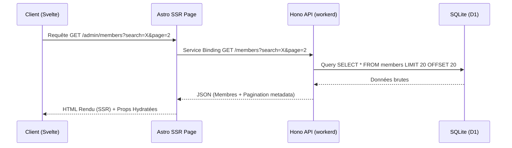

# Spécification de Design : Refactorisation de l'UI des Membres (Shadcn Svelte)

* **Date** : 16 Juillet 2026
* **Statut** : Approuvé

---

## 1. Objectif & Portée
L'objectif est d'harmoniser l'interface utilisateur du module **Membres** (Adhérents) en migrant les composants Svelte existants vers la bibliothèque de primitives partagées **Shadcn Svelte** intégrée dans `@metacult/shared-ui`.

Les composants cibles sont :
* `MembersTable.svelte` : Liste des adhérents avec recherche, filtres et pagination.
* `MemberProfile.svelte` : Fiche détaillée de l'adhérent avec état de cotisation et historique financier.

---

## 2. Architecture & Composants UI

### A. Table des Adhérents (`MembersTable.svelte`)
* **Barre d'outils de filtrage** :
  * Un `<Input>` de recherche principal avec une icône `Search`.
  * Un bouton `<Button>` avec icône `Filter` ouvrant un `<Popover.Root>`.
  * Le popover regroupe les sélections secondaires suivantes :
    * **Saison** (Sélecteur de la saison active/précédente).
    * **Genre** (Hommes / Femmes / Tous).
    * **Type** (Compétiteur / Loisir / Tous).
    * **Statut** (Valide / Suspendu / Tous).
    * Bouton d'action "Réinitialiser" pour vider les filtres.
* **Tableau Principal** :
  * Utilisation de la structure `<Table.Root>`, `<Table.Header>`, `<Table.Row>`, `<Table.Cell>` standard de Shadcn.
  * Colonnes : Adhérent, Licence, Genre, Type, Statut, Actions.
  * Badge d'état de cotisation stylisé : Vert/Destructive selon le statut.
* **Actions par Ligne** :
  * Un bouton déclencheur d'actions `<Button variant="ghost" size="icon">` avec icône `MoreVertical`.
  * Un `<Popover.Root>` local par ligne affichant les liens :
    * "Voir profil" (redirection).
    * "Attestation CSE" (ouverture de la facture PDF dans un nouvel onglet, conditionné au paiement effectif).
* **Pagination** :
  * Utilisation uniforme des boutons `<Button variant="outline" size="icon">` (`ChevronLeft`, `ChevronRight`).

### B. Fiche Profil Adhérent (`MemberProfile.svelte`)
* **En-tête** :
  * Lien de retour à la liste avec flèche gauche (`ArrowLeft`).
  * En-tête de profil (`Card.Root` de Shadcn) affichant les détails de base (nom complet, numéro de licence) et un badge large indiquant le paiement.
* **Mise en page par Onglets (`Tabs.Root`)** :
  * **Onglet "Profil & Contacts"** :
    * Informations personnelles (Naissance, Genre).
    * Contacts légaux des parents pour les mineurs (Nom, E-mail, Téléphone).
  * **Onglet "Cotisation Poona"** :
    * Vue d'ensemble financière : Montant Dû, Montant Reçu, Solde restant.
    * Barre de progression visuelle illustrant le pourcentage de cotisation réglé.
  * **Onglet "Historique Financier"** :
    * Tableau `<Table.Root>` listant toutes les transactions du Grand Livre (`adhesions_inscriptions` et autres) liées à cet adhérent.

---

## 3. Flux de Données & États (Server-Side URL-Based)
Conformément aux choix d'architecture, les filtres et la pagination sont gérés via des transitions d'URL (Server-Side Rendering).

---

## 4. Stratégie de Test & Validation
* **Tests Unitaires (Vitest)** :
  * `MembersTable.test.ts` : Valider le rendu des lignes de membres, la saisie dans le filtre de recherche, et la navigation des pages.
  * `MemberProfile.test.ts` : Valider la sélection des onglets et l'affichage conditionnel de l'attestation CSE.
* **Compilation TypeScript** : Validation via `npx astro check --root apps/admin-console`.
