# Vertical Slice Architecture Modular Reorganization & UI Components Standardization Design

## 1. Context & Objectives
We have successfully decoupled database schemas and mounted Hono sub-routers into feature-specific libraries. However, two major architectural items remain to satisfy full Vertical Slice Architecture (VSA) and Nx modular guidelines:
1. **Monolithic API Test Suite**: The 66 API integration tests are centralized in `apps/api/src/index.test.ts`. This monolithic file creates test maintenance overhead and violates feature isolation.
2. **Monolithic UI Components**: Svelte frontend components are placed flat inside `apps/admin-console/src/components/`, violating VSA boundaries. Additionally, styling (buttons, tables, inputs, alert callouts, cards, badges) is hardcoded individually across these components instead of being unified.

### Objectives
* **Isolate API route tests** into their respective vertical slice libraries (`libs/features/[feature]/api/src/routes.test.ts`).
* **Extract shared test utilities** (Mock D1, SQLite memory schema builder, Drizzle runner) to `@metacult/shared-db` to share them across tests and eliminate duplication.
* **Initialize domain-specific UI libraries** (`@metacult/features-[feature]-ui`) under `libs/features/[feature]/ui` and move Svelte components there.
* **Initialize a shared UI components library** (`@metacult/shared-ui`) containing standardized, tailwind-styled **Shadcn-Svelte** primitives (Button, Table, Pagination, Badge, Alert, Card, Input, Modal, Drawer, etc.) to guarantee absolute UX/UI consistency.
* **Update Astro page controllers** to reference components via path aliases.

---

## 2. Target Architecture Diagram

```mermaid
graph TD
    %% Applications
    admin[apps/admin-console]
    api_app[apps/api]

    %% Shared Libs
    shared_db[libs/shared/db]
    shared_ui[libs/shared/ui]

    %% Feature Libs - Members
    f_mem_api[libs/features/members/api]
    f_mem_db[libs/features/members/data-access]
    f_mem_ui[libs/features/members/ui]

    %% Feature Libs - Accounting
    f_acc_api[libs/features/accounting/api]
    f_acc_db[libs/features/accounting/data-access]
    f_acc_ui[libs/features/accounting/ui]

    %% Feature Libs - Expenses
    f_exp_api[libs/features/expenses/api]
    f_exp_db[libs/features/expenses/data-access]
    f_exp_ui[libs/features/expenses/ui]

    %% Feature Libs - Shop
    f_shop_api[libs/features/shop/api]
    f_shop_db[libs/features/shop/data-access]
    f_shop_ui[libs/features/shop/ui]

    %% Dependency Arrows
    admin --> f_mem_ui
    admin --> f_acc_ui
    admin --> f_exp_ui
    admin --> f_shop_ui
    admin --> shared_ui

    api_app --> f_mem_api
    api_app --> f_acc_api
    api_app --> f_exp_api
    api_app --> f_shop_api

    f_mem_api --> f_mem_db
    f_acc_api --> f_acc_db
    f_exp_api --> f_exp_db
    f_shop_api --> f_shop_db

    f_mem_ui --> shared_ui
    f_acc_ui --> shared_ui
    f_exp_ui --> shared_ui
    f_shop_ui --> shared_ui

    f_mem_db --> shared_db
    f_acc_db --> shared_db
    f_exp_db --> shared_db
    f_shop_db --> shared_db

    %% Test Dependency Arrow (dashed)
    f_mem_api -.->|imports MockD1| shared_db
    f_acc_api -.->|imports MockD1| shared_db
    f_exp_api -.->|imports MockD1| shared_db
    f_shop_api -.->|imports MockD1| shared_db
```



---

## 3. Detail Specifications

### Part 1: API Tests Decoupling
To avoid repeating Mock D1 logic, we will introduce `libs/shared/db/src/test-utils.ts` and expose it under `@metacult/shared-db/test-utils` or direct export:
* **MockD1Database** & **MockD1PreparedStatement**: Relocated from `index.test.ts` to `test-utils.ts`.
* **setupMockDb()**: Runs migrations dynamically on a new in-memory `DatabaseSync` instance, returning a ready-to-use Drizzle connection object:
  ```typescript
  import { drizzle } from 'drizzle-orm/d1';
  import { MockD1Database } from './test-utils';
  
  export async function setupMockDb() {
    const mockD1 = new MockD1Database();
    const db = drizzle(mockD1 as any);
    // Execute migrations sequentially from libs/shared/db/migrations
    // ...
    return { mockD1, db };
  }
  ```

#### Sub-router Test Isolation
In each `routes.test.ts` file, Hono route handlers will be tested independently without referencing `apps/api`:
```typescript
import { Hono } from 'hono';
import { membersRouter } from './routes';
import { setupMockDb } from '@metacult/shared-db';

const app = new Hono<{ Bindings: { DB: any } }>();
app.route('/members', membersRouter);

describe('Members API Routes', () => {
  it('GET /members should return paginated list', async () => {
    const { mockD1 } = await setupMockDb();
    const res = await app.request('http://localhost/members', {}, { DB: mockD1 });
    expect(res.status).toBe(200);
  });
});
```

---

### Part 2: UI Feature Libraries & Shared UI
We will configure 5 new Nx libraries:
* `libs/shared/ui` (`@metacult/shared-ui`) - containing Shadcn Svelte primitives.
* `libs/features/members/ui` (`@metacult/features-members-ui`)
* `libs/features/accounting/ui` (`@metacult/features-accounting-ui`)
* `libs/features/expenses/ui` (`@metacult/features-expenses-ui`)
* `libs/features/shop/ui` (`@metacult/features-shop-ui`)

#### Component Distribution Mapping
1. **`@metacult/features-members-ui`**:
   * `MemberProfile.svelte`, `MembersTable.svelte`, `PoonaImporter.svelte` (and `.test.ts` files).
2. **`@metacult/features-accounting-ui`**:
   * `BankStatementReconciliation.svelte`, `InitialBalancesConfig.svelte`, `TransactionLedger.svelte`, `CheckDepositManager.svelte`, `CashBoxManager.svelte`, `GeneralMeetingReport.svelte`, `SettingsManager.svelte`.
3. **`@metacult/features-expenses-ui`**:
   * `ExpensesManager.svelte`.
4. **`@metacult/features-shop-ui`**:
   * `OrdersManager.svelte`, `ProductsManager.svelte`.

#### Shared UI Primitives (`@metacult/shared-ui`)
We will generate Shadcn-Svelte components into `libs/shared/ui/src/components/ui/` and export them:
* **`button`**: Standard tailwind button.
* **`table`**: Table, TableHeader, TableBody, TableHead, TableRow, TableCell.
* **`input` / `textarea` / `select`**: Base form controls.
* **`badge`**: Reusable color-coded status badges.
* **`alert`**: Alert callouts with success/warning/destructive variants.
* **`card`**: Card, CardHeader, CardTitle, CardContent, CardFooter.
* **`dialog` / `drawer`**: Dialog components for modales and slide-out drawers.

Feature Svelte components will import components from `@metacult/shared-ui` rather than repeating inline styles, achieving visual uniformity across all screens.

---

## 4. ESLint Module Boundary Constraints
Under `eslint.config.js`, we will enforce:
* `type:ui` projects can only depend on `type:ui` and `scope:shared`.
* Domain UI libraries can only depend on their own domain scopes and shared scopes:
  * `scope:accounting` UI -> `@metacult/shared-ui`, `@metacult/features-members-ui` (allowed dependency for accounting), `@metacult/shared-db`.
  * `scope:members` UI -> `@metacult/shared-ui`, `@metacult/shared-db`.
  * `scope:expenses` UI -> `@metacult/shared-ui`, `@metacult/shared-db`.
  * `scope:shop` UI -> `@metacult/shared-ui`, `@metacult/shared-db`.

---

## 5. Verification Plan

### Test Suites Execution
Verify that all tests pass:
```bash
npx vitest run
```

### Type Checking & Build Compilation
Verify Svelte and Astro compilation:
```bash
npx astro check --root apps/admin-console
npx astro check --root apps/boutique
npx tsc --noEmit
```

### Linting Check
Verify boundaries:
```bash
npx eslint .
```
